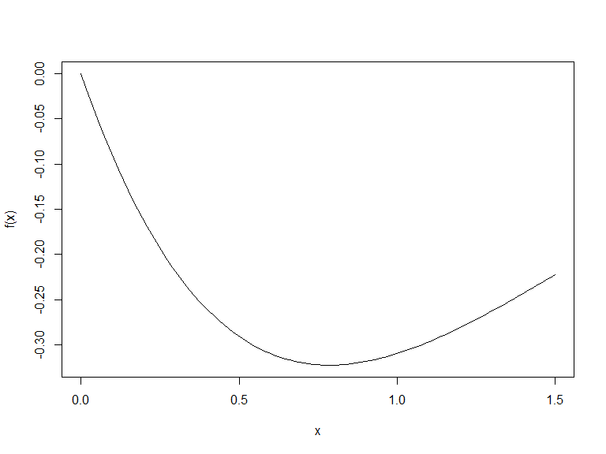

Homework 2 on Newton’s methods
================
Jared Garfinkel jsg2145
Due: 03/18/2020, Wednesday, by 1pm

# Problem 1

Design an optimization algorithm to find the minimum of the continuously
differentiable function \(f(x) =-e^{-1}\sin(x)\) on the closed interval
\([0,1.5]\). Write out your algorithm and implement it into .

# Answer: your answer starts here…

``` r
#R codes:

f = function(x){
  return(-sin(x)*exp(-x))
}


optimize(f, interval = c(0, 1.5))
```

    ## $minimum
    ## [1] 0.7854043
    ## 
    ## $objective
    ## [1] -0.3223969

``` r
curve(f, from = 0, to = 1.5)
```



``` r
w = .618
a =  0
b = 1.5
tol = 1e-10
i = 0  # iteration index
x1 = (1 - w) * (b - a) + a
x2 = x1 + w * (b - a) * (1 - w)
res = c(a, b, x1, x2)

findmin = function() {
  while (abs(b - a) > tol) {
    i <- i + 1
    if (f(b) > f(a)) {
      b <- x2
      x1 <- (1 - w) * (b - a) + a
      x2 <- x1 + w * (b - a) * (1 - w)
    }
    else {
      a <- x1
      x1 <- x2
      x2 <- x1 + w * (b - a) * (1 - w)
    }
    res <- rbind(res, c(i, a, b, x1, x2))
  }

    return(res)
}

findmin()
```

    ##     [,1]      [,2]      [,3]      [,4]      [,5]
    ## res    0 1.5000000 0.5730000 0.9271140 0.0000000
    ##        1 0.5730000 1.5000000 0.9271140 1.1459565
    ##        2 0.5730000 1.1459565 0.7918694 0.9271306
    ##        3 0.5730000 0.9271306 0.7082779 0.7918796
    ##        4 0.7082779 0.9271306 0.7918796 0.8435455
    ##        5 0.7082779 0.8435455 0.7599501 0.7918836
    ##        6 0.7599501 0.8435455 0.7918836 0.8116184
    ##        7 0.7599501 0.8116184 0.7796874 0.7918851
    ##        8 0.7599501 0.7918851 0.7721493 0.7796884
    ##        9 0.7721493 0.7918851 0.7796884 0.7843475
    ##       10 0.7796884 0.7918851 0.7843475 0.7872269
    ##       11 0.7796884 0.7872269 0.7825681 0.7843477
    ##       12 0.7825681 0.7872269 0.7843477 0.7854475
    ##       13 0.7843477 0.7872269 0.7854475 0.7861272
    ##       14 0.7843477 0.7861272 0.7850275 0.7854476
    ##       15 0.7850275 0.7861272 0.7854476 0.7857072
    ##       16 0.7850275 0.7857072 0.7852872 0.7854476
    ##       17 0.7852872 0.7857072 0.7854476 0.7855468
    ##       18 0.7852872 0.7855468 0.7853863 0.7854476
    ##       19 0.7852872 0.7854476 0.7853485 0.7853863
    ##       20 0.7853485 0.7854476 0.7853863 0.7854097
    ##       21 0.7853863 0.7854476 0.7854097 0.7854242
    ##       22 0.7853863 0.7854242 0.7854008 0.7854097
    ##       23 0.7853863 0.7854097 0.7853953 0.7854008
    ##       24 0.7853953 0.7854097 0.7854008 0.7854042
    ##       25 0.7853953 0.7854042 0.7853987 0.7854008
    ##       26 0.7853953 0.7854008 0.7853974 0.7853987
    ##       27 0.7853974 0.7854008 0.7853987 0.7853995
    ##       28 0.7853974 0.7853995 0.7853982 0.7853987
    ##       29 0.7853974 0.7853987 0.7853979 0.7853982
    ##       30 0.7853979 0.7853987 0.7853982 0.7853984
    ##       31 0.7853979 0.7853984 0.7853981 0.7853982
    ##       32 0.7853981 0.7853984 0.7853982 0.7853983
    ##       33 0.7853981 0.7853983 0.7853982 0.7853982
    ##       34 0.7853981 0.7853982 0.7853981 0.7853982
    ##       35 0.7853981 0.7853982 0.7853982 0.7853982
    ##       36 0.7853982 0.7853982 0.7853982 0.7853982
    ##       37 0.7853982 0.7853982 0.7853982 0.7853982
    ##       38 0.7853982 0.7853982 0.7853982 0.7853982
    ##       39 0.7853982 0.7853982 0.7853982 0.7853982
    ##       40 0.7853982 0.7853982 0.7853982 0.7853982
    ##       41 0.7853982 0.7853982 0.7853982 0.7853982
    ##       42 0.7853982 0.7853982 0.7853982 0.7853982
    ##       43 0.7853982 0.7853982 0.7853982 0.7853982
    ##       44 0.7853982 0.7853982 0.7853982 0.7853982
    ##       45 0.7853982 0.7853982 0.7853982 0.7853982
    ##       46 0.7853982 0.7853982 0.7853982 0.7853982
    ##       47 0.7853982 0.7853982 0.7853982 0.7853982
    ##       48 0.7853982 0.7853982 0.7853982 0.7853982
    ##       49 0.7853982 0.7853982 0.7853982 0.7853982

``` r
min = last(findmin())
```

The minimum according to the golden ratio search method is 0.785. This
closely approximates the result of optimize(), 0.785.

# Problem 2

The Poisson distribution is often used to model \`\`count’’ data — e.g.,
the number of events in a given time period.  
The Poisson regression model states that
\[Y_i \sim \textrm{Poisson}(\lambda_i),\] where
\[\log \lambda_i = \alpha + \beta x_i \] for some explanatory variable
\(x_i\). The question is how to estimate \(\alpha\) and \(\beta\) given
a set of independent data
\((x_1, Y_1), (x_2, Y_2), \ldots, (x_n, Y_n)\).

The Poisson distribution is given by
\[P(Y=y) = \frac{\lambda^y e^{-\lambda}}{y!}\] for \(\lambda > 0\).

# Answer: your answer starts here…

``` r
#R codes:

poissonstuff <- function(dat, betavec) {
  alpha = betavec[1]
  beta = betavec[2]
  log_lambda <- alpha + beta * dat$x
  lambda <- exp(log_lambda)
  loglik <- sum(dat$y * log_lambda - lambda - log(factorial(dat$y)))
  grad <- c(sum(dat$y * dat$x - dat$x * lambda), 
            sum(dat$y - lambda))
  Hess <- matrix((-1) * c((-1) * sum(dat$x^2 * lambda),
                    rep((-1) * sum(dat$x * lambda), 2),
                    (-1) * sum(lambda)), ncol = 2)
  return(list(loglik = loglik, grad = grad, Hess = Hess))
}
```

``` r
set.seed(22)
n <- 5000
truebeta <- c(1, .03)
x <- rnorm(n)
lambda <- exp(truebeta[1] + truebeta[2] * x)
y = rpois(n, lambda)
dat = list(x=x, y=y)
```

``` r
NewtonRaphson <- function(dat, func, start, tol = 1e-5, maxiter = 200) {
  i <- 0
  cur <- start
  stuff <- func(dat, cur)
  l = 1
  prevloglik <- -Inf      # To make sure it iterates
  res = c(0, stuff$loglik, cur)
  while (i < maxiter && abs(stuff$loglik - prevloglik) > tol) {
    i = i + 1
    if (t(stuff$grad) %*% stuff$Hess %*% stuff$grad > 0) {
      Hess = stuff$Hess - 3*diag(max(stuff$Hess), nrow(stuff$Hess))
    }
    else {
      Hess = stuff$Hess
    }
    prev <- cur
    grad <- stuff$grad
    prevloglik <- stuff$loglik
    cur = prev - l * solve(Hess) %*% grad
    stuff = func(dat, cur)
    res <- rbind(res, c(i, stuff$loglik, cur)) # Add current values to results matrix
    while (stuff$loglik < prevloglik) {
      i = i + 1
      if (t(stuff$grad) %*% stuff$Hess %*% stuff$grad > 0) {
        Hess = stuff$Hess - 3*diag(max(stuff$Hess), nrow(stuff$Hess))
      }
      else {
        Hess = stuff$Hess
      }
      l = 0.5*l
      cur <- prev - l * solve(Hess) %*% grad
      stuff = func(dat, cur)
      res = rbind(res, c(i, stuff$loglik, cur))
    }
  }
  return(res)
}
```

``` r
NewtonRaphson <- function(dat, func, start, tol = 1e-10, maxiter = 200) {
  i <- 0
  cur <- start
  stuff <- func(dat, cur)
  loglik <- stuff$loglik
  res <- c(0, stuff$loglik, cur)
  l = 1
  prevloglik <- -Inf      # To make sure it iterates
  while (i < maxiter && abs(stuff$loglik - prevloglik) > tol) {
    i <- i + 1
    prevloglik <- stuff$loglik
    Hess <- stuff$Hess
    prev <- cur
    grad <- stuff$grad
    cur <- prev - l * solve(Hess) %*% grad
    stuff <- func(dat, cur)
    if (t(grad) %*% Hess %*% grad > 0) {
      Hess = Hess - 3*diag(max(Hess), nrow(Hess))
    }
    else {
      Hess = Hess
    }
    cur = prev - l * t(Hess) %*% grad
    stuff = func(dat, cur)
    while (stuff$loglik < prevloglik) {
    l = 0.5*l
    i = i + 1 
    prevloglik = stuff$loglik
    Hess = stuff$Hess
    prev = cur
    grad = stuff$grad
    cur <- prev - l * t(Hess) %*% grad
    stuff <- func(dat, cur)        # log-lik, gradient, Hessian
    }
    res <- rbind(res, c(i, stuff$loglik, cur)) # Add current values to results matrix
  }
  return(res)
}
```

``` r
NewtonRaphson(list(x=x, y=y), poissonstuff, start = c(1, -2))
```

    ##     [,1]       [,2]     [,3]      [,4]
    ## res    0  -96057.68 1.000000 -2.000000
    ##        1 -144188.99 1.221782 -2.095149
    ##        2 -108443.00 1.067971 -2.028832
    ##        3 -104615.89 1.047792 -2.020431
    ##        4 -100423.33 1.024963 -2.010683
    ##        5  -98325.47 1.013123 -2.005622
    ##        6  -97213.96 1.006734 -2.002887
    ##        7  -96642.04 1.003414 -2.001464
    ##        8  -96351.50 1.001720 -2.000738
    ##        9  -96205.01 1.000863 -2.000370
    ##       10  -96131.46 1.000432 -2.000185
    ##       11  -96094.60 1.000216 -2.000093
    ##       12  -96076.15 1.000108 -2.000046
    ##       13  -96066.92 1.000054 -2.000023
    ##       14  -96062.30 1.000027 -2.000012
    ##       15  -96059.99 1.000014 -2.000006
    ##       16  -96058.84 1.000007 -2.000003
    ##       17  -96058.26 1.000003 -2.000001
    ##       18  -96057.97 1.000002 -2.000001
    ##       19  -96057.83 1.000001 -2.000000
    ##       20  -96057.76 1.000000 -2.000000
    ##       21  -96057.72 1.000000 -2.000000
    ##       22  -96057.70 1.000000 -2.000000
    ##       23  -96057.69 1.000000 -2.000000
    ##       24  -96057.69 1.000000 -2.000000
    ##       25  -96057.69 1.000000 -2.000000
    ##       26  -96057.68 1.000000 -2.000000
    ##       27  -96057.68 1.000000 -2.000000
    ##       28  -96057.68 1.000000 -2.000000
    ##       29  -96057.68 1.000000 -2.000000
    ##       30  -96057.68 1.000000 -2.000000
    ##       31  -96057.68 1.000000 -2.000000
    ##       32  -96057.68 1.000000 -2.000000
    ##       33  -96057.68 1.000000 -2.000000
    ##       34  -96057.68 1.000000 -2.000000
    ##       35  -96057.68 1.000000 -2.000000
    ##       36  -96057.68 1.000000 -2.000000
    ##       37  -96057.68 1.000000 -2.000000
    ##       38  -96057.68 1.000000 -2.000000
    ##       39  -96057.68 1.000000 -2.000000
    ##       40  -96057.68 1.000000 -2.000000
    ##       41  -96057.68 1.000000 -2.000000
    ##       42  -96057.68 1.000000 -2.000000
    ##       43  -96057.68 1.000000 -2.000000
    ##       44  -96057.68 1.000000 -2.000000
    ##       45  -96057.68 1.000000 -2.000000
    ##       46  -96057.68 1.000000 -2.000000
    ##       47  -96057.68 1.000000 -2.000000
    ##       48  -96057.68 1.000000 -2.000000
    ##       49  -96057.68 1.000000 -2.000000
    ##       50  -96057.68 1.000000 -2.000000
    ##       51  -96057.68 1.000000 -2.000000
    ##       52  -96057.68 1.000000 -2.000000

``` r
poissonstuff(list(x=x, y=y), c(1, -2))
```

    ## $loglik
    ## [1] -96057.68
    ## 
    ## $grad
    ## [1] 197341.3 -85893.6
    ## 
    ## $Hess
    ##           [,1]      [,2]
    ## [1,]  487160.0 -197009.5
    ## [2,] -197009.5   99545.6

Consider the ABO blood type data, where you have
\(N_{\mbox{obs}} = (N_A,N_B,N_O,N_{AB}) = ( 26, 27, 42, 7)\).

# Answer: your answer starts here…

``` r
blood_dat = tibble(
  obs = c(26, 27, 42, 7),
  type = c("A", "B", "O", "AB")
)

pars = tibble(
  p_o = .33,
  p_a = .33,
  p_b = .33
)

fpars = function(p_a = p_a, p_b = p_b, p_o = p_o){
  pars = tibble(
   p_o,
   p_a,
   p_b
  )
}
```

``` r
n_aa = function(df = blood_dat, pars){
  df %>% 
  filter(type == "A") %>%
  pull(obs) %>% 
  prod(., pars$p_a^2, (pars$p_a^2 + 2 * pars$p_a * pars$p_o)^(-1))
}

n_ao = function(df = blood_dat, pars){
  df %>% 
  filter(type == "A") %>%
  pull(obs) %>% 
  prod(., 2, pars$p_a, pars$p_o, (pars$p_a^2 + 2 * pars$p_a * pars$p_o)^(-1))
}

n_bb = function(df = blood_dat, pars){
  df %>% 
  filter(type == "B") %>%
  pull(obs) %>% 
  prod(., pars$p_b^2, (pars$p_a^2 + 2 * pars$p_b * pars$p_o)^(-1))
}

n_bo = function(df = blood_dat, pars){
  df %>% 
  filter(type == "B") %>%
  pull(obs) %>% 
  prod(., 2, pars$p_b, pars$p_o, (pars$p_a^2 + 2 * pars$p_b * pars$p_o)^(-1))
}

n_ab = blood_dat %>% 
  filter(type == "AB") %>% 
  pull(obs)

n_oo = blood_dat %>% 
  filter(type == "O") %>% 
  pull(obs)
```

``` r
fnobs = function(df = blood_dat, pars = pars) {
  nobs = tibble(
    N_AA = n_aa(blood_dat, pars),
    N_AO = n_ao(blood_dat, pars),
    N_BB = n_bb(blood_dat, pars),
    N_BO = n_bo(blood_dat, pars),
    N_AB = n_ab,
    N_OO = n_oo
  )
  return(nobs)
}

nobs = fnobs(blood_dat, pars)
```

``` r
nobs = tibble(
  N_AA = n_aa(blood_dat, pars),
  N_AO = n_ao(blood_dat, pars),
  N_BB = n_bb(blood_dat, pars),
  N_BO = n_bo(blood_dat, pars),
  N_AB = n_ab,
  N_OO = n_oo
)
```

``` r
lik = function(nobs, pars) {
    loglik = nobs$N_AA * log(pars$p_a^2) + nobs$N_AO * log(2*pars$p_a*pars$p_o) + nobs$N_BB * log(pars$p_b^2) + nobs$N_BO * log(2*pars$p_b*pars$p_o) + nobs$N_AB*log(2*pars$p_a*pars$p_b) + nobs$N_OO * log(pars$p_o^2) + log(factorial(sum(nobs)))/prod(factorial(nobs$N_AA), factorial(nobs$N_AO), factorial(nobs$N_BB), factorial(nobs$N_BO), factorial(nobs$N_AB), factorial(nobs$N_OO))
    return(loglik)
}
```

``` r
delta = function(df = blood_dat, nobs = nobs, pars = c(p_a = .33, p_b = .33, p_o = .33), tol = 1e-10, maxiter = 200){
  i = 0
  p_o = pars$p_o
  p_b = pars$p_b
  p_a = pars$p_a
  prevpars = fpars(p_a, p_b, p_o)
  prevloglik = -Inf
  loglik = lik(nobs, pars)
  prevnobs = fnobs(blood_dat, pars)
  res = c(0, loglik, prevpars)
  while (i < maxiter && abs(loglik - prevloglik) > tol) {
    i = i + 1
    prevloglik = loglik
    prevnobs = nobs
    lambda = (2) * sum(nobs)
    p_a = (2 * prevnobs$N_AA + prevnobs$N_AO + prevnobs$N_AB)/(lambda)
    p_b = (2 * prevnobs$N_BB + prevnobs$N_BO + prevnobs$N_AB)/(lambda)
    p_o = (2 * prevnobs$N_OO + prevnobs$N_AO + prevnobs$N_BO)/(lambda)
    pars = fpars(p_a, p_b, p_o)
    nobs = fnobs(blood_dat, pars)
    loglik = lik(nobs, pars)
    res = rbind(res, c(i, loglik, pars))
  }
  return(res)
}
```

``` r
delta(blood_dat, nobs, pars)
```

    ##                  p_o       p_a       p_b      
    ## res 0  -196.8239 0.33      0.33      0.33     
    ##     1  -151.4549 0.5849673 0.2042484 0.2107843
    ##     2  -148.1427 0.6319013 0.1802591 0.1878395
    ##     3  -147.8275 0.6379783 0.1771892 0.1848325
    ##     4  -147.7893 0.6387278 0.1768208 0.1844514
    ##     5  -147.7842 0.638821  0.1767777 0.1844013
    ##     6  -147.7835 0.638833  0.1767729 0.1843941
    ##     7  -147.7834 0.6388347 0.1767725 0.1843929
    ##     8  -147.7833 0.6388349 0.1767724 0.1843926
    ##     9  -147.7833 0.638835  0.1767724 0.1843926
    ##     10 -147.7833 0.638835  0.1767724 0.1843926
    ##     11 -147.7833 0.638835  0.1767724 0.1843926
    ##     12 -147.7833 0.638835  0.1767725 0.1843926
    ##     13 -147.7833 0.638835  0.1767725 0.1843926
    ##     14 -147.7833 0.638835  0.1767725 0.1843926
    ##     15 -147.7833 0.638835  0.1767725 0.1843926
    ##     16 -147.7833 0.638835  0.1767725 0.1843926
    ##     17 -147.7833 0.638835  0.1767725 0.1843926
    ##     18 -147.7833 0.638835  0.1767725 0.1843926
